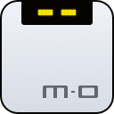

<div>
  
  <h1>Motrix Takeover</h1>
  <p>A Firefox extension that hands your browser downloads to Motrix in one click</p>
</div>

[](https://github.com/udstd0038/motrix-takeover/releases) [](https://github.com/udstd0038/motrix-takeover/releases) [](./LICENSE)

English | [简体中文](./README.zh-CN.md)

## Overview

Motrix Takeover is a Firefox extension that turns "download this" into a single click: instead of the browser's own download manager, the file goes to [Motrix](https://motrix.app) — with your login session carried along, so even files behind a sign-in download fine. It also handles things browsers can't, like assembling HLS/DASH streaming video into a single file with FFmpeg.

**Motrix Takeover is a community fork of the official [Motrix Extension](https://github.com/motrixapp/motrix-extension).** The official extension is being rolled out alongside Motrix 2, and its store links were not published yet when this fork was created. This repository ships the full-featured extension under an independent identity, so you can build, install, and pair it today.

The extension speaks two open protocols defined by the Motrix project:

- **MDXP** (Motrix Download eXchange Protocol) — the JSON-RPC 2.0 application layer for submitting downloads, managing tasks, and streaming progress;
- **MBP1** (Motrix Bridge Pairing Protocol v1) — the SPAKE2 password-authenticated key exchange plus AES-256-GCM envelope that secures the connection between the browser and the Motrix bridge.

Everything about the pairing protocol and security is unchanged from the official codebase, which passed six independent adversarial crypto reviews. This fork only changes the extension identity.

## 🧪 Status

Motrix 2 is currently in beta. This fork is verified end-to-end against **Motrix 2.0.0-beta.32** (Windows 11, Firefox 154). Pre-built packages signed by Mozilla are published on [GitHub Releases](https://github.com/udstd0038/motrix-takeover/releases); install the latest `motrix-takeover-<version>-signed.xpi` and follow the pairing guide below.

| | Official extension | This fork |
|---|---|---|
| Gecko ID (Firefox) | `motrix-extension@motrix.app` | `motrix-takeover@local.dev` |
| Native-messaging host name | `app.motrix.bridge` | `app.motrix.bridge.takeover` |
| Display name | Motrix Extension | Motrix Takeover |
| Motrix identity verdict | `official` | `attested-non-official` (pairs normally, shown without branding) |
| Protocol / crypto code | — | Unchanged |

## ✨ Features

- 📥 One-click download takeover — eligible Firefox downloads go straight to Motrix, with a minimum-size threshold and a per-host denylist
- 🔐 Authenticated downloads — request headers and cookies are replayed so files behind a login work without manual cookie copying
- 🎬 Streaming video (HLS/DASH) — Motrix downloads the segments and merges audio/video with FFmpeg
- 🧲 Magnet links — handed straight to the torrent workflow
- 🖱 Right-click — "Download with Motrix" on any link
- ✍️ Manual tasks — paste an HTTP(S) or `magnet:` link into the popup
- 🔍 Page resource sniffer — list video / audio / images already loaded by the current page and submit a selection in one batch
- 🖥 Remote Motrix Server — pair with a `ws://` / `wss://` Motrix Server (cookies and headers stay off until you explicitly grant them per Server)
- ↩️ Handoff failure recovery — if Motrix can't accept a download, it is restored to the browser; failures are explained in plain words ("session expired", "DRM-protected", …)
- 🌍 16 UI languages, including Simplified Chinese and English

## 🧩 Ecosystem

Motrix Takeover connects to the same Motrix ecosystem as the official extension:

| Project | Distribution | What it does |
|---------|--------------|--------------|
| [Motrix](https://github.com/agalwood/Motrix) | Desktop app / headless server | The download manager that owns the engine, bridge, and pairing dialogs |
| [`@motrix/mdxp`](https://github.com/motrixapp/mdxp) | npm package | Defines the shared JSON-RPC 2.0 wire schemas and Zod types for MDXP |
| [Motrix Extension](https://github.com/motrixapp/motrix-extension) | Browser extension | The official Chrome / Edge / Firefox extension this fork is based on |
| **Motrix Takeover** (this repo) | Signed `.xpi` on GitHub Releases | The community fork with an independent identity, installable today |

## 📦 Installation

### From the signed release (recommended)

1. Download `motrix-takeover-<version>-signed.xpi` from the [latest release](https://github.com/udstd0038/motrix-takeover/releases/latest).
2. Open it with Firefox (or drag it onto a Firefox window, or use **about:addons → gear → Install Add-on From File**).
3. Click **Add** in the permission prompt.
4. Register the native-messaging host (Windows PowerShell):

   ```powershell
   powershell -ExecutionPolicy Bypass -File .\scripts\register-nm-host.ps1
   ```

5. Pair with Motrix: click the toolbar icon → **Connect**, then enter the 8-character code shown in Motrix's approval dialog.

A `SHA256SUMS.txt` file is published alongside every release.

### From source

Development requires Node.js 22.13 or later and pnpm 11 (see `packageManager` in `package.json`).

```bash
git clone https://github.com/udstd0038/motrix-takeover.git
cd motrix-takeover

pnpm install --frozen-lockfile
pnpm run build:firefox     # Output: dist/firefox/
```

Load the unpacked build with **about:debugging#/runtime/this-firefox → Load Temporary Add-on → dist/firefox/manifest.json**. Temporary add-ons are removed when Firefox restarts; use the signed release for permanent installation.

### Pairing notes

- Motrix must be running with **Settings → Integration → Browser extensions → "Send downloads from browser extensions"** enabled (it is by default).
- The 8-character code is the pairing password; key confirmation inside the SPAKE2 exchange is the proof of approval — there is no second approval click.
- Adding the extension ID under **Motrix → Settings → Integration → Browser extensions → Trusted extensions** is optional. Without it, the extension still pairs and shows as `attested-non-official`.
- Reconnects use a long-lived credential — no code is needed after the first pairing.

## 🛠 Development

```bash
pnpm dev              # Chromium development build
pnpm dev:firefox      # Firefox development build
pnpm test             # 2000+ unit tests, incl. all MBP1 normative vectors
pnpm lint             # Biome checks
pnpm run build:firefox
```

Main areas: `src/background/` (pairing, connections, download handoff, task controls), `src/popup/`, `src/options/`, `src/content/` (page-resource detection), `src/adapters/` (site adapters), `src/background/mbp1/` (the MBP1 protocol implementation).

The crypto dependencies are pinned by the protocol specification (`@noble/curves@2.4.0`, `@noble/hashes@2.4.0`). Upgrading them requires re-running every normative vector — see `scripts/test-mbp1-full-pair.mjs` and the `devtools/` folder for the verification harness used against a real Motrix 2.0.0-beta.32.

## 🔧 Tech stack

| Area | Stack |
|------|-------|
| Extension runtime | Manifest V3 (Firefox `background.scripts` + `type: module`) |
| UI | React 19 + Tailwind CSS 4 + shadcn-style components |
| Language | TypeScript in strict mode |
| Build system | Vite 8 + `@crxjs/vite-plugin`, separate `chromium` / `firefox` / `webstore` variants |
| Validation | Zod 4 for settings, frames, and wire schemas |
| Protocol | `@motrix/mdxp` (JSON-RPC 2.0) over an AES-256-GCM envelope |
| Pairing crypto | SPAKE2 (edwards25519) via `@noble/curves` 2.4.0, scrypt/HKDF/HMAC via `@noble/hashes` 2.4.0 |
| Local transport | Native Messaging (`motrix-native-host` from the Motrix app) → `motrix-bridge.v1` WebSocket |
| Internationalization | i18next + react-i18next, 16 locales |
| Quality tooling | Biome, Vitest |

The extension has two strict layers, mirroring the Motrix codebase's boundaries:

```
popup / options / content (React UI + page sniffers)
   |  runtime messages (MessageBus)
background service worker (MBP1 pairing, MDXP connection, download handoff)
   |  native messaging / WebSocket (motrix-bridge.v1)
Motrix bridge (desktop app)
   |
aria2 (download engine)
```

## 🤝 Contributing

This is a community fork — issues and pull requests are welcome on this repository. Protocol-level bugs and feature requests belong upstream: the [official extension repository](https://github.com/motrixapp/motrix-extension) and the [Motrix repository](https://github.com/agalwood/Motrix).

## 📜 License

[MIT](./LICENSE) © 2026-present Motrix project contributors

See [`THIRD_PARTY_NOTICES.md`](./THIRD_PARTY_NOTICES.md) for third-party license information. This fork is based on [motrixapp/motrix-extension](https://github.com/motrixapp/motrix-extension) (MIT); the protocol specifications belong to the [Motrix](https://github.com/agalwood/Motrix) project.
